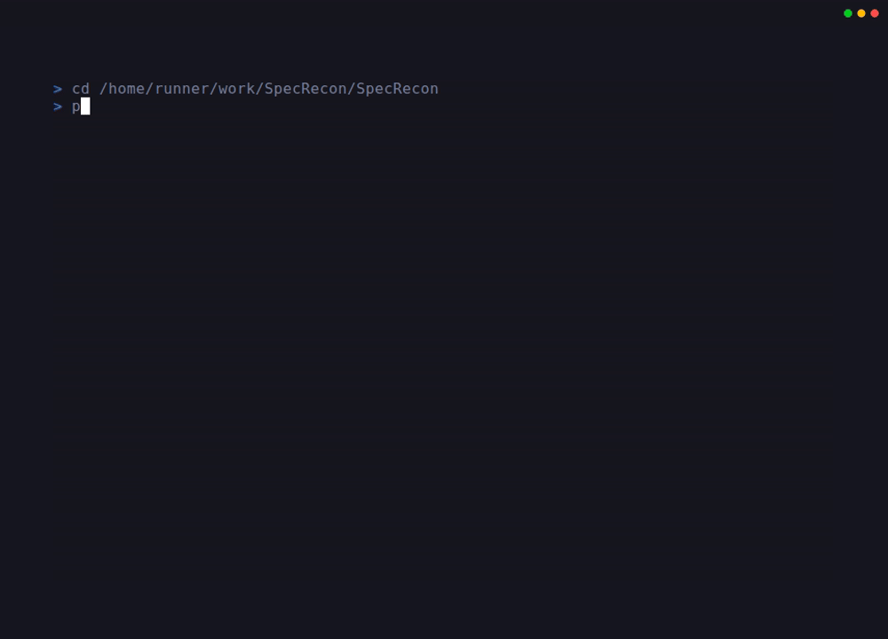
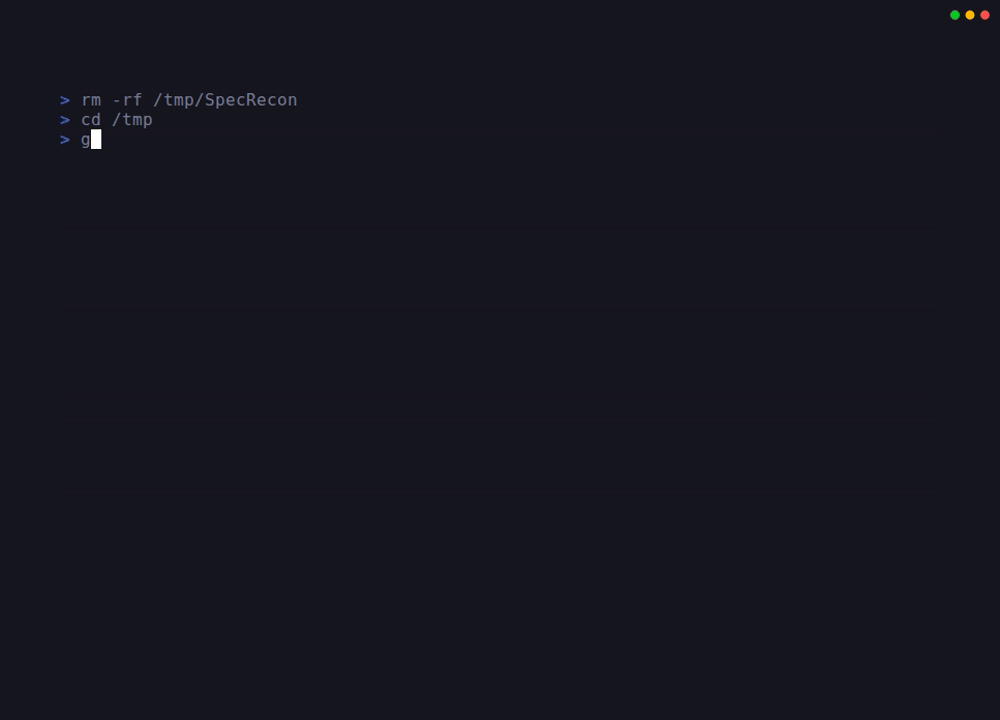

# UndREST-SpecQL — API Spec Query Engine

**SpeQL** is an API Spec Query Analyser that uses CodeQL and a built-in Python analyzer to scan Azure REST API specifications for security vulnerabilities — including SilentReaper patterns, Key Vault misconfigurations, missing access control, and exposed credentials.

SpeQL is the engine that feeds **[APISpy](https://github.com/UndREST-Labs/UndREST-APISpy)** — it exports a structured index of every Azure REST API operation, which APISpy uses for real-time request classification in the browser.

> **SilentReaper** is a vulnerability class characterized by an API emitting a SAS URI in its response, which becomes dangerous when combined with improper RBAC or inadequate control/data plane isolation.

## Table of Contents

- [Quick Start with CLI Menu](#quick-start-with-cli-menu)
- [Tools Overview](#tools-overview)
- [Vulnerabilities Detected](#vulnerabilities-detected)
- [Repository Structure](#repository-structure)
- [Smart Memory Management](#smart-memory-management)
- [Installation](#installation)
- [Usage](#usage)
- [Database Management](#database-management)
- [Export Pipeline](#export-pipeline)
- [Query Details](#query-details)
- [Ecosystem](#ecosystem)
- [Contributing](#contributing)
- [License](#license)

## Quick Start with CLI Menu

```bash
# Install dependencies
pip3 install -r requirements.txt

# Launch the interactive CLI menu
python3 SpeQL.py
```



The CLI menu provides:
- **Intuitive navigation** - Browse all actions organised by category
- **Interactive prompts** - Step-by-step guidance for complex operations
- **ASCII art logo** - SpeQL branding via figlet (falls back gracefully if not installed)
- **Comprehensive coverage** - Access to all scripts and tools
- **Smart memory management** - Automatic CodeQL memory optimisation for large databases

### CLI Menu Structure

- 📊 **Security Analysis** - Run security scans on Azure API specifications
- 🗄️ **Database Management** - Clone, update, and rebuild the CodeQL database
- 🔍 **CodeQL Security Queries** - Execute CodeQL queries and view results
- 📈 **SARIF Analysis Tools** - Analyse SARIF output for threat hunting
- ⚙️ **Setup and Installation** - Automated setup and dependency management
- 📚 **Documentation and Help** - Access guides and documentation
- ℹ️ **About SpeQL** - Learn about the tool and its capabilities

### Alternative: Direct Command-Line Usage

For automation or scripting, use the individual scripts directly:

```bash
python3 analyze.py          # Run security analysis
python3 refresh_database.py # Update database
./run-queries.sh            # Run CodeQL queries
```

## Tools Overview

| Tool | Entry Point | Description |
|------|-------------|-------------|
| **Interactive CLI** | `SpeQL.py` | Menu-driven interface for all SpeQL actions |
| **Python Security Analyzer** | `analyze.py` | Standalone scanner; no CodeQL required; detects SilentReaper, Key Vault misconfigs, missing access control, hardcoded credentials |
| **CodeQL Query** | `queries/azure-security/SasUriInResponse.ql` | Detects Azure SAS tokens exposed in API example responses — the defining characteristic of SilentReaper vulnerabilities |
| **Database Refresh** | `refresh-database.sh` · `refresh_database.py` | Clone and build a CodeQL database from the Azure REST API spec corpus |
| **SARIF Analysis Tools** | `scripts/sarif-analysis/` | Shell scripts for deduplicating, parsing, and prioritising CodeQL findings |
| **Export Pipeline** | `scripts/export/export_api_inventory.py` | Walks the spec corpus and produces a structured JSON index of every Azure REST API operation, published to APISpy via GitHub Releases |

## Vulnerabilities Detected

### 1. Insecure Logic App Trigger (SilentReaper Pattern)

Detects Logic App HTTP triggers that can be invoked without authentication:
- Missing authentication configuration
- Weak authentication (None/Anonymous)
- Public HTTP endpoints without access control

**CWE References**: CWE-306 (Missing Authentication), CWE-862 (Missing Authorization)

### 2. Insecure Key Vault Configuration

Identifies Key Vault misconfigurations that expose secrets:
- Missing network restrictions
- Public network access enabled
- Overly permissive access policies
- Embedded secrets instead of Key Vault references

**CWE References**: CWE-284 (Improper Access Control), CWE-522 (Insufficiently Protected Credentials)

### 3. Missing Access Control

Finds API endpoints without proper security:
- Sensitive operations (DELETE, CREATE, UPDATE) without authentication
- Endpoints with empty security arrays
- Public workflow access without restrictions

**CWE References**: CWE-284, CWE-862

### 4. Insecure Credentials

Locates hardcoded credentials and secrets:
- Connection strings with embedded passwords
- Hardcoded API keys and secrets
- Basic authentication with visible passwords
- Secure strings with default values

**CWE References**: CWE-798 (Hardcoded Credentials), CWE-259 (Hard-coded Password)

### 5. SAS URI Exposure in API Responses (CodeQL) — SilentReaper

The CodeQL query (`SasUriInResponse.ql`) detects Azure Shared Access Signature (SAS) URIs in API example responses:
- SAS tokens in response bodies (`inputsLink`, `outputsLink`, etc.)
- URIs containing signature parameters (`sig`, `se`, `sp`, `sv`)
- Control-plane APIs exposing data-plane access credentials

**Security Impact**: SAS URIs grant time-limited access to Azure resources. When exposed in control-plane API responses with improper RBAC or inadequate control/data plane isolation, they can enable unauthorised data-plane access and data exfiltration.

**CWE References**: CWE-200 (Exposure of Sensitive Information), CWE-359

## Repository Structure

```
UndREST-SpecQL/
├── README.md
├── CONTRIBUTING.md
├── LICENSE
├── SpeQL.py                     # Interactive CLI menu entry point
├── setup.sh                     # Automated setup script
├── refresh-database.sh          # Bash script to refresh database
├── refresh_database.py          # Python script to refresh database
├── analyze.py                   # Python-based security analyzer (no CodeQL required)
├── run-queries.sh               # CodeQL query execution script
├── config/
│   └── SpeQL.yml               # CodeQL database configuration
├── database/                   # CodeQL database (generated)
│   └── azure-api-db/
├── demos/                      # Demo GIFs (01–07)
├── docs/                       # Documentation
│   ├── CODEQL_WORKFLOW.md
│   ├── DATABASE_REFRESH.md
│   ├── EXAMPLE_OUTPUT.md
│   ├── MEMORY_MANAGEMENT.md
│   ├── QUICKSTART.md
│   ├── QUICK_REFERENCE.md
│   ├── REPOSITORY_STRUCTURE.md
│   ├── SARIF_ANALYSIS_QUICKSTART.md
│   └── inventory/
│       ├── API_INDEX_SCHEMA.md
│       ├── CONSUMER_GUIDE.md
│       └── EXPORT_PIPELINE.md
├── inventory/                  # Export artifacts (generated)
│   └── api-index-sharded-<run-id>.zip
├── queries/
│   └── azure-security/
│       ├── SasUriInResponse.ql # Detects SAS URIs in API example responses
│       └── qlpack.yml
├── results/                    # Analysis results (generated)
├── scripts/
│   ├── export/                 # API inventory export pipeline
│   │   ├── export_api_inventory.py
│   │   └── normalize_api_inventory.py
│   └── sarif-analysis/         # SARIF analysis and threat hunting tools
│       ├── deduplicate-by-product-operation.sh
│       ├── parse-sarif-endpoints.sh
│       ├── prioritize-threats.sh
│       └── README.md
├── tests/
│   ├── test_api_inventory_export.py
│   ├── test_api_inventory_normalization.py
│   ├── test_json_file_count_fix.sh
│   ├── test_memory_management.sh
│   └── vhs/                    # VHS tape recordings for animated GIF demos (01–07)
└── utils/
    └── memory_utils.sh         # Memory management utilities
```

## Smart Memory Management

SpeQL includes intelligent memory management for CodeQL query execution.

- **Automatic Detection**: Detects total system memory on Linux and macOS
- **Smart Optimisation**: Applies memory limits (90% of total RAM) for databases with >50K JSON files
- **Manual Override**: Set custom limits via `CODEQL_MEMORY_LIMIT` environment variable

```bash
./run-queries.sh                          # Automatic
export CODEQL_MEMORY_LIMIT=4096 && ./run-queries.sh  # Manual
```

For detailed information, see [docs/MEMORY_MANAGEMENT.md](docs/MEMORY_MANAGEMENT.md).

## Installation

### Quick Setup (Recommended)

```bash
./setup.sh
```



This installs Java Development Kit, CodeQL CLI 2.20.2, and all required CodeQL query pack dependencies.

### Manual Installation

#### 1. Java Development Kit (JDK)

```bash
# Ubuntu/Debian
sudo apt-get install openjdk-17-jdk
java -version
```

#### 2. CodeQL CLI

> **Important**: CodeQL 2.23.x+ has compatibility issues with JSON-only databases. Use **2.20.1 or 2.20.2**.

```bash
wget https://github.com/github/codeql-cli-binaries/releases/download/v2.20.2/codeql-linux64.zip
unzip codeql-linux64.zip
export PATH="$PATH:$(pwd)/codeql"

# Install query pack dependencies
cd queries/azure-security && codeql pack install && cd ../..

codeql version
./run-queries.sh
```

#### 3. Python Dependencies

```bash
pip3 install -r requirements.txt
```

## Usage

### Python Analyzer

```bash
python3 analyze.py
```


```bash
# Verbose mode
python3 analyze.py --verbose

# Specific Azure service
python3 analyze.py --source azure-rest-api-specs/specification/keyvault

# All Azure services (after cloning with --all)
python3 analyze.py --source azure-rest-api-specs/specification
```

### CodeQL Queries


```bash
# Build database then run queries
python3 refresh_database.py --path specification/keyvault --fresh
./run-queries.sh
```

Results are saved in SARIF format in `results/` and can be viewed in VS Code (SARIF Viewer extension) or uploaded to GitHub Advanced Security.

### SARIF Analysis for Threat Hunting


```bash
# Deduplicate findings
./scripts/sarif-analysis/deduplicate-by-product-operation.sh results/SasUriInResponse-results.sarif

# Extract structured endpoint data as CSV
./scripts/sarif-analysis/parse-sarif-endpoints.sh -f csv results/SasUriInResponse-results.sarif

# Prioritise by severity
./scripts/sarif-analysis/prioritize-threats.sh --threshold high results/SasUriInResponse-results.sarif
```

See [scripts/sarif-analysis/README.md](scripts/sarif-analysis/README.md) for full documentation.

## Database Management

```bash
# Update and rebuild (default: Logic Apps)
./refresh-database.sh

# Fresh clone
./refresh-database.sh --fresh

# Specific service
./refresh-database.sh --path specification/keyvault

# All Azure specifications
./refresh-database.sh --all

# Repo only (no CodeQL build)
./refresh-database.sh --skip-db-build
```


For full documentation, see [docs/DATABASE_REFRESH.md](docs/DATABASE_REFRESH.md).

## Export Pipeline

The export pipeline walks `azure-rest-api-specs/specification/` and produces a structured JSON index of every Azure REST API operation.

```bash
python3 scripts/export/export_api_inventory.py \
  --source azure-rest-api-specs/specification \
  --output-dir inventory/ \
  --sharded --minified --verbose
```

**Output formats:**
- `api-index.json` — Flat pretty-printed index
- `api-index-grouped.json` — Grouped/deduplicated (schema 3.0.0)
- `shards/{Provider.Namespace}.min.json` — Per-provider shards for APISpy

**Cross-repo pipeline:** The `daily-api-index-export-sharded.yml` workflow runs nightly, publishes the sharded zip to the `shards-latest` GitHub Release, and triggers [UndREST-APISpy](https://github.com/UndREST-Labs/UndREST-APISpy) to update its extension shard data automatically.

See [docs/inventory/EXPORT_PIPELINE.md](docs/inventory/EXPORT_PIPELINE.md) for the full schema and consumer guide.

## Query Details

### SasUriInResponse.ql

| Attribute | Value |
|-----------|-------|
| **ID** | `azure/sas-uri-in-response` |
| **Severity** | Error |
| **Security Severity** | 8.5 |
| **Precision** | High |
| **CWE** | CWE-200, CWE-359 |

Detects API specs that emit Azure Shared Access Signature (SAS) URIs in API responses. SAS URIs contain sensitive tokens granting time-limited access to Azure resources.

## Ecosystem

SpeQL is part of the [UndREST Labs](https://github.com/UndREST-Labs) ecosystem:

| Project | Repo | Description |
|---------|------|-------------|
| **SpeQL** | *(this repo)* | Query and reason about API behaviour; the engine that feeds APISpy |
| **APISpy** | [UndREST-APISpy](https://github.com/UndREST-Labs/UndREST-APISpy) | Real-time visibility into API calls in the browser; powered by SpeQL exports |
| **Atlas** | *(future)* | Mapping API ecosystems at scale |

> **Observe → Understand → Map → Evolve**

## Contributing

See [CONTRIBUTING.md](CONTRIBUTING.md) for guidelines on adding new security queries, improving existing ones, and contributing to the export pipeline.

For APISpy (extension, portal sweep, shard preparation), see [UndREST-APISpy](https://github.com/UndREST-Labs/UndREST-APISpy).

## License

See [LICENSE](LICENSE).
