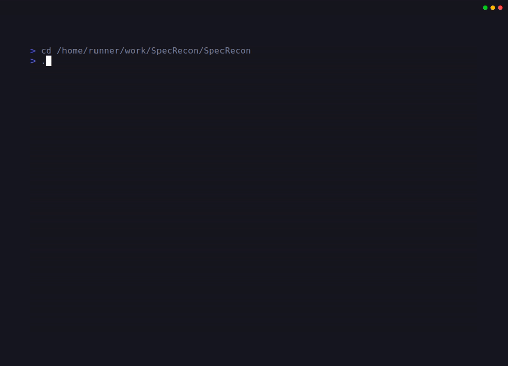

# SARIF Analysis Scripts - Quick Reference

This is a quick reference guide for the SARIF analysis scripts. For detailed documentation, see [scripts/sarif-analysis/README.md](../scripts/sarif-analysis/README.md).



## Prerequisites

- `jq` (JSON processor) must be installed
- SARIF result files from CodeQL queries (in `results/` directory)

## Basic Usage

### 1. Deduplicate by Product + Operation

Identify unique vulnerable patterns across API versions:

```bash
# Show unique product/operation combinations
./scripts/sarif-analysis/deduplicate-by-product-operation.sh results/SasUriInResponse-results.sarif

# Show grouped by product
./scripts/sarif-analysis/deduplicate-by-product-operation.sh -f grouped results/SasUriInResponse-results.sarif

# Show summary statistics
./scripts/sarif-analysis/deduplicate-by-product-operation.sh -f summary results/SasUriInResponse-results.sarif
```

### 2. Parse and Extract Endpoint Data

Extract structured data in multiple formats:

```bash
# Display as table (default)
./scripts/sarif-analysis/parse-sarif-endpoints.sh results/SasUriInResponse-results.sarif

# Export to CSV
./scripts/sarif-analysis/parse-sarif-endpoints.sh -f csv -o endpoints.csv results/SasUriInResponse-results.sarif

# Export to JSON
./scripts/sarif-analysis/parse-sarif-endpoints.sh -f json results/SasUriInResponse-results.sarif
```

### 3. Prioritize by Threat Severity

Focus on critical control plane/data plane isolation issues:

```bash
# Show all threats with priority
./scripts/sarif-analysis/prioritize-threats.sh results/SasUriInResponse-results.sarif

# Show only critical threats
./scripts/sarif-analysis/prioritize-threats.sh --threshold critical results/SasUriInResponse-results.sarif

# Generate markdown report
./scripts/sarif-analysis/prioritize-threats.sh -f markdown -o report.md results/SasUriInResponse-results.sarif
```

## Common Workflows

### Complete Threat Hunting Analysis

```bash
# 1. Run CodeQL queries
./run-queries.sh

# 2. Identify unique patterns
./scripts/sarif-analysis/deduplicate-by-product-operation.sh \
    -f grouped results/SasUriInResponse-results.sarif

# 3. Focus on critical threats
./scripts/sarif-analysis/prioritize-threats.sh \
    --threshold critical -v results/SasUriInResponse-results.sarif

# 4. Export detailed data
./scripts/sarif-analysis/parse-sarif-endpoints.sh \
    -f csv --include-lines results/SasUriInResponse-results.sarif > analysis.csv
```

### Bulk Processing Multiple SARIF Files

```bash
# Process all SARIF files
for sarif in results/*.sarif; do
    name=$(basename "$sarif" .sarif)
    echo "Processing $name..."
    
    # Deduplicate
    ./scripts/sarif-analysis/deduplicate-by-product-operation.sh \
        -o "analysis-$name-unique.txt" "$sarif"
    
    # Parse to CSV
    ./scripts/sarif-analysis/parse-sarif-endpoints.sh \
        -f csv -o "analysis-$name.csv" "$sarif"
    
    # Prioritize
    ./scripts/sarif-analysis/prioritize-threats.sh \
        --threshold high -f json -o "analysis-$name-priorities.json" "$sarif"
done
```

## Script Options Summary

### deduplicate-by-product-operation.sh

| Option | Description |
|--------|-------------|
| `-h, --help` | Show help message |
| `-o, --output FILE` | Output file (default: stdout) |
| `-v, --verbose` | Verbose output with statistics |
| `-f, --format FMT` | Output format: unique\|grouped\|summary (default: unique) |

### parse-sarif-endpoints.sh

| Option | Description |
|--------|-------------|
| `-h, --help` | Show help message |
| `-o, --output FILE` | Output file (default: stdout) |
| `-f, --format FMT` | Output format: json\|csv\|table (default: table) |
| `-v, --verbose` | Verbose output with statistics |
| `--include-lines` | Include line numbers in output |
| `--include-messages` | Include result messages in output |

### prioritize-threats.sh

| Option | Description |
|--------|-------------|
| `-h, --help` | Show help message |
| `-o, --output FILE` | Output file (default: stdout) |
| `-f, --format FMT` | Output format: table\|json\|markdown (default: table) |
| `-v, --verbose` | Verbose output with analysis details |
| `--threshold LEVEL` | Priority threshold: critical\|high\|medium\|low\|all (default: all) |

## Priority Levels

| Level | Description | Examples |
|-------|-------------|----------|
| **CRITICAL** | Direct SAS token exposure in control plane APIs | Storage management APIs exposing blob SAS tokens |
| **HIGH** | Control plane APIs with data plane access patterns | ARM APIs for Compute, KeyVault, or Storage |
| **MEDIUM** | APIs with potential isolation issues | Data plane APIs with token/credential exposure |
| **LOW** | General security concerns | Other findings requiring review |

## Output Format Examples

### Unique List (deduplicate)
```
Microsoft.Storage/blob
Microsoft.Storage/queue
Microsoft.Logic/workflows
```

### CSV (parse-sarif-endpoints)
```csv
Product,Operation,Version,Stability,File
Microsoft.Storage,blob,2021-09-01,stable,specification/storage/.../blob.json
```

### JSON (prioritize-threats)
```json
{"product":"Microsoft.Storage","operation":"blob","priority":"CRITICAL","threat":"Control plane API exposes SAS tokens"}
```

## Tips

1. **Use verbose mode** (`-v`) to see statistics and debug information
2. **Combine scripts** in pipelines for comprehensive analysis
3. **Export to CSV** for easy analysis in spreadsheets like Excel
4. **Use threshold filtering** to focus on the most critical issues first
5. **Save results** to files for tracking over time or comparing different scans

## Getting Help

- View script help: `./scripts/sarif-analysis/<script-name>.sh --help`
- Detailed documentation: [scripts/sarif-analysis/README.md](../scripts/sarif-analysis/README.md)
- Main repository README: [README.md](../README.md)

## Related Resources

- [Azure SilentReaper Vulnerability](https://cirriustech.co.uk/blog/azure-silent-reaper/)
- [SARIF Specification](https://docs.oasis-open.org/sarif/sarif/v2.1.0/sarif-v2.1.0.html)
- [jq Manual](https://jqlang.github.io/jq/manual/)
